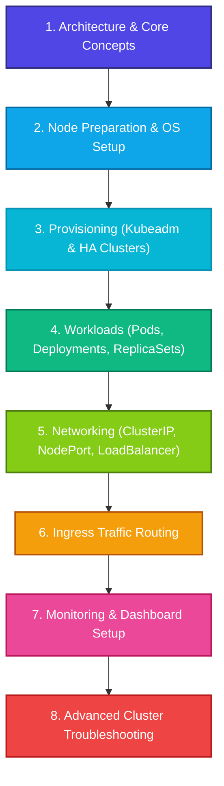

# ☸️ Kubernetes (K8s) DevOps Hub

> A curated, beautifully structured collection of Kubernetes technical guides, command cheat sheets, High-Availability (HA) cluster architecture walkthroughs, and hands-on diagnostic playbooks.

---

## 📖 Introduction

Welcome to the **Kubernetes DevOps Hub**! This repository serves as an enterprise-grade reference manual and training guide for Cloud & DevOps engineers looking to master Kubernetes administration, cluster provisioning, microservices routing, and production troubleshooting. 

This repository has been fully structured into clean, standardized Markdown formats containing robust, ready-to-run configurations, copy-pasteable YAML manifests, and real-world system debugging traces.

---

## 🗺️ Documentation Directory & Navigation Map

Navigate through the comprehensive modules in this workspace:

### 🏗️ 1. Cluster Architecture & Basics
* 📘 [Kubernetes Components Guide](file:///c:/Users/prem/Desktop/Cloud%20Computing/DevOps/k8s/K8s_componentes.md) - Learn about the Control Plane (API-Server, etcd, Scheduler, Controllers) and Node-level binaries (Kubelet, Kube-Proxy).
* 🔧 [Kubeadm Cluster Init (CentOS/RHEL)](file:///c:/Users/prem/Desktop/Cloud%20Computing/DevOps/k8s/kubeadm_init.md) - Learn how to build a single-master Kubernetes cluster from scratch.
* 🛡️ [HA K8s Cluster Setup Guide](file:///c:/Users/prem/Desktop/Cloud%20Computing/DevOps/k8s/HA_K8s_cluster_document.md) - Step-by-step master plan for setting up a highly available control plane with etcd quorum and an Nginx load balancer.

### ⚙️ 2. Workload & Service Routing
* 📦 [Deployment Management](file:///c:/Users/prem/Desktop/Cloud%20Computing/DevOps/k8s/k8s_Deployment.md) - Master Declarative Deployments, scaling replicas, rollouts, and historical undo modifications.
* 🔌 [Service Exposure Handbook](file:///c:/Users/prem/Desktop/Cloud%20Computing/DevOps/k8s/k8s_svc.md) - Real hands-on experience exposing pods via ClusterIP, NodePort, LoadBalancer, and hardcoded static node ports.
* 🌐 [Nginx Ingress Controller](file:///c:/Users/prem/Desktop/Cloud%20Computing/DevOps/k8s/Nginx%20Ingress%20Controller%20in%20Kubernetes.md) - Install and run the Nginx Ingress controller for high-performance traffic routing.
* 🍎 [Ingress Routing Examples](file:///c:/Users/prem/Desktop/Cloud%20Computing/DevOps/k8s/k8s-ingress-example.md) - Practical host-based routing simulations using http-echo pods.
* 🧪 [Ingress Testing Playbook](file:///c:/Users/prem/Desktop/Cloud%20Computing/DevOps/k8s/k8s%20Ingress-test.md) - Connect your internal cluster services to custom local domain names (`my-app.com`) using ingress rewrites.

### 🛠️ 3. Cheat Sheets & Playbooks
* 📝 [Play with Kubernetes Cheat Sheet](file:///c:/Users/prem/Desktop/Cloud%20Computing/DevOps/k8s/play_with_k8s.md) - A fast, all-in-one cheat sheet covering namespaces, pods, replication controllers, services, and taints.
* 💻 [Ultimate K8s Command Sheet](file:///c:/Users/prem/Desktop/Cloud%20Computing/DevOps/k8s/K8s_cmds.md) - Massive administrative command book with inbound firewall rules, Heapster metrics, and dashboard integrations.
* 🔓 [EC2 SSH Userdata Script](file:///c:/Users/prem/Desktop/Cloud%20Computing/DevOps/k8s/enable-passowrd-ssh-with-userdata.md) - Quick helper script to enable SSH password authentication on AWS EC2 nodes during bootstrap.

### 🩺 4. Debugging & Troubleshooting
* 🚨 [Basic Troubleshooting Playbook](file:///c:/Users/prem/Desktop/Cloud%20Computing/DevOps/k8s/k8s_basic_troubleshooting.md) - Diagnose CrashLoopBackOff, ImagePullBackOff, OOMKilled states, and schedule cordons.
* 🗒️ [Diagnostic & Administration Logs](file:///c:/Users/prem/Desktop/Cloud%20Computing/DevOps/k8s/k8s_trouble_shooting_steps.md) (Alternative: [1.md](file:///c:/Users/prem/Desktop/Cloud%20Computing/DevOps/k8s/1.md)) - Real-world master-node shell logs documenting pod failures, restores, and joins.

---

## 🚀 The Kubernetes Learning Roadmap

Follow this step-by-step roadmap to become a Kubernetes Certified Administrator (CKA/CKAD):



### 📍 Phase 1: Core Fundamentals
* Learn control plane components, scheduling models, and etcd data storage.
* *Resource:* [K8s_componentes.md](file:///c:/Users/prem/Desktop/Cloud%20Computing/DevOps/k8s/K8s_componentes.md)

### 📍 Phase 2: Single-Node & Multi-Master Provisioning
* Understand kernel parameters (`br_netfilter`), disabling swap space, setting hosts mappings, and running CNI fabrics.
* Practice setting up external Nginx load-balancers to route traffic securely to control-plane APIServers on `port 6443`.
* *Resources:* [kubeadm_init.md](file:///c:/Users/prem/Desktop/Cloud%20Computing/DevOps/k8s/kubeadm_init.md) & [HA_K8s_cluster_document.md](file:///c:/Users/prem/Desktop/Cloud%20Computing/DevOps/k8s/HA_K8s_cluster_document.md)

### 📍 Phase 3: Workload Scaling & Declarative Configurations
* Author precise `.yaml` specs, control scale counts (`--replicas=N`), execute RollingUpdates, and rollout undos.
* *Resources:* [k8s_Deployment.md](file:///c:/Users/prem/Desktop/Cloud%20Computing/DevOps/k8s/k8s_Deployment.md) & [play_with_k8s.md](file:///c:/Users/prem/Desktop/Cloud%20Computing/DevOps/k8s/play_with_k8s.md)

### 📍 Phase 4: Networking & Advanced Ingress Controllers
* Set up internal Service abstractions, dynamic load balancers, and static `NodePort` targets.
* Implement path-based routing rules, host headers, custom local domains (`example.com`), and install the Nginx Ingress Controller.
* *Resources:* [k8s_svc.md](file:///c:/Users/prem/Desktop/Cloud%20Computing/DevOps/k8s/k8s_svc.md), [Nginx Ingress Controller in Kubernetes.md](file:///c:/Users/prem/Desktop/Cloud%20Computing/DevOps/k8s/Nginx%20Ingress%20Controller%20in%20Kubernetes.md), & [k8s-ingress-example.md](file:///c:/Users/prem/Desktop/Cloud%20Computing/DevOps/k8s/k8s-ingress-example.md)

### 📍 Phase 5: Debugging, Metrics, & Administration
* Master event logs querying (`kubectl get events`), pod details descriptions, resource metrics troubleshooting (CPU/Memory/OOMKilled), cordoning nodes, and recovering deployments using active configuration backups.
* *Resources:* [k8s_basic_troubleshooting.md](file:///c:/Users/prem/Desktop/Cloud%20Computing/DevOps/k8s/k8s_basic_troubleshooting.md) & [K8s_cmds.md](file:///c:/Users/prem/Desktop/Cloud%20Computing/DevOps/k8s/K8s_cmds.md)

---

## 💻 Cluster Setup Quick Start

To instantly fire up your single-master cluster (assuming prerequisites are met):

```bash
# 1. Disable swap space (Required for kubeadm)
sudo swapoff -a

# 2. Initialize the cluster
sudo kubeadm init --pod-network-cidr=10.244.0.0/16

# 3. Configure kubectl for your user
mkdir -p $HOME/.kube
sudo cp -i /etc/kubernetes/admin.conf $HOME/.kube/config
sudo chown $(id -u):$(id -g) $HOME/.kube/config

# 4. Deploy Flannel CNI Network fabric
kubectl apply -f https://raw.githubusercontent.com/flannel-io/flannel/master/Documentation/kube-flannel.yml
```

---

## 🛠️ Contribution & Local Use

1. Feel free to copy, alter, or add new configuration snippets to these guides.
2. Keep manifests clean and formatted with `YAML` syntax fences.
3. Test your commands inside a sandbox cluster (e.g. Minikube, Kind, or AWS EC2 instances).

*Happy Kubernetes Hacking! 🚀*
