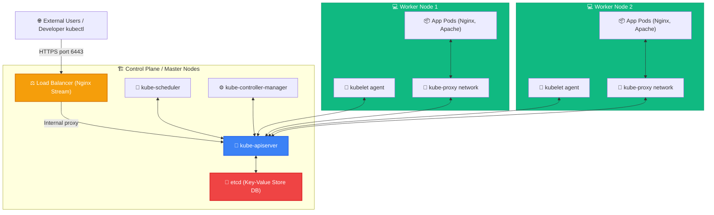
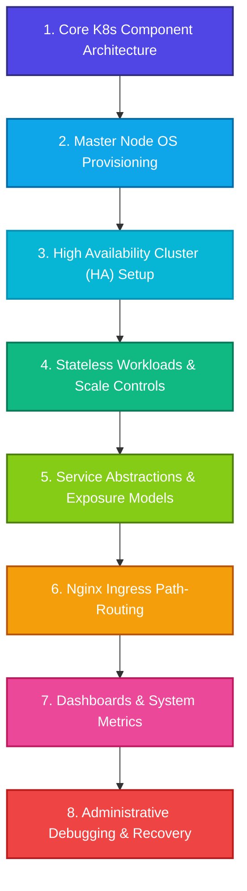

# <p align="center">☸️ Kubernetes (K8s) DevOps Hub & Production Playbooks</p>

<p align="center">
  
  
  
  
  
  
</p>

<p align="center">
  <strong>An enterprise-grade, curated reference repository and production-ready playbook suite for DevOps engineers mastering Kubernetes administration, cluster operations, and highly available architectures.</strong>
</p>

---

## 📋 Table of Contents
1. [📖 Introduction](#-introduction)
2. [🏗️ Cluster Architecture Overview](#%EF%B8%8F-cluster-architecture-overview)
3. [🗺️ Interactive Navigation Map](#%EF%B8%8F-interactive-navigation-map)
4. [🗂️ Detailed File & Topic Directory](#%EF%B8%8F-detailed-file--topic-directory)
5. [📈 Dynamic Learning Roadmap](#-dynamic-learning-roadmap)
6. [🔀 CNI Network Fabrics Comparison](#-cni-network-fabrics-comparison)
7. [📊 Environment & Compatibility Matrix](#-environment--compatibility-matrix)
8. [🛡️ Production Best Practices & Hardening](#%EF%B8%8F-production-best-practices--hardening)
9. [💻 Fast Cluster Bootstrap Guide](#-fast-cluster-bootstrap-guide)
10. [🤝 Contributing & Support](#-contributing--support)

---

## 📖 Introduction

Welcome to the **Kubernetes DevOps Hub**! In production environments, deploying, maintaining, and debugging containerized workloads requires robust, standardized procedures. This hub consolidates years of field-tested cluster bootstrap playbooks, highly available (HA) multi-master patterns, CNI installations, ingress control, and real-world disaster recovery sessions into standard, fully formatted Markdown resources.

Whether studying for your **CKA (Certified Kubernetes Administrator)** or managing live cloud deployments, these production playbooks are built to assist you every step of the way.

---

## 🏗️ Cluster Architecture Overview

Here is a visual map showing the structural layout of a standard Kubernetes multi-node cluster, illustrating how the Control Plane components interact with Worker nodes and external load balancers:



---

## 🗺️ Interactive Navigation Map

Browse modules directly using the mapped links below:

### 🏗️ 1. Cluster Provisioning & Core
* 📘 [Kubernetes Components Guide](file:///c:/Users/prem/Desktop/Cloud%20Computing/DevOps/k8s/K8s_componentes.md) - Deep architectural dive into Master & Worker binaries.
* 🔧 [Kubeadm Cluster Init (CentOS/RHEL)](file:///c:/Users/prem/Desktop/Cloud%20Computing/DevOps/k8s/kubeadm_init.md) - Single-master cluster installations from scratch.
* 🛡️ [HA K8s Cluster Setup Guide](file:///c:/Users/prem/Desktop/Cloud%20Computing/DevOps/k8s/HA_K8s_cluster_document.md) - Highly Available Control Plane setup using `--upload-certs` and stream proxies.

### ⚙️ 2. Workload & Service Routing
* 📦 [Deployment Management](file:///c:/Users/prem/Desktop/Cloud%20Computing/DevOps/k8s/k8s_Deployment.md) - Declarative specs, replica scaling, upgrades, and rollback operations.
* 🔌 [Service Exposure Handbook](file:///c:/Users/prem/Desktop/Cloud%20Computing/DevOps/k8s/k8s_svc.md) - ClusterIP, NodePort, LoadBalancer, and hardcoded NodePorts configurations.
* 🌐 [Nginx Ingress Controller](file:///c:/Users/prem/Desktop/Cloud%20Computing/DevOps/k8s/Nginx%20Ingress%20Controller%20in%20Kubernetes.md) - High-performance reverse-proxy ingress deployments.
* 🍎 [Ingress Routing Examples](file:///c:/Users/prem/Desktop/Cloud%20Computing/DevOps/k8s/k8s-ingress-example.md) - Practical multi-path http-echo routing exercises.
* 🧪 [Ingress Testing Playbook](file:///c:/Users/prem/Desktop/Cloud%20Computing/DevOps/k8s/k8s%20Ingress-test.md) - Rewrite rule routing tests utilizing custom local hosts configurations.

### 🛠️ 3. Cheat Sheets & Playbooks
* 📝 [Play with Kubernetes Cheat Sheet](file:///c:/Users/prem/Desktop/Cloud%20Computing/DevOps/k8s/play_with_k8s.md) - Fast command sheet covering namespaces, pods, RC, services, and taints.
* 💻 [Ultimate K8s Command Sheet](file:///c:/Users/prem/Desktop/Cloud%20Computing/DevOps/k8s/K8s_cmds.md) - Comprehensive command suite, Heapster setups, dashboard integrations, and firewall configuration rules.
* 🔓 [EC2 SSH Userdata Script](file:///c:/Users/prem/Desktop/Cloud%20Computing/DevOps/k8s/enable-passowrd-ssh-with-userdata.md) - Script automating SSH authentication and user additions during host bootstrap.

### 🩺 4. Debugging & Troubleshooting
* 🚨 [Basic Troubleshooting Playbook](file:///c:/Users/prem/Desktop/Cloud%20Computing/DevOps/k8s/k8s_basic_troubleshooting.md) - Diagnostics for standard failure states (OOM, CrashLoopBackOff, taints).
* 🗒️ [Diagnostic & Administration Logs](file:///c:/Users/prem/Desktop/Cloud%20Computing/DevOps/k8s/k8s_trouble_shooting_steps.md) (Alternative: [1.md](file:///c:/Users/prem/Desktop/Cloud%20Computing/DevOps/k8s/1.md)) - Real terminal session logs documenting node cordoning and backup-restore workflows.

---

## 🗂️ Detailed File & Topic Directory

Below is a granular index mapping exactly what content and topics are present within each file in this repository:

### 🏗️ Module A: Control Plane & Provisioning

#### 1. [K8s_componentes.md](file:///c:/Users/prem/Desktop/Cloud%20Computing/DevOps/k8s/K8s_componentes.md)
* **Topics Covered:**
  * **Master Nodes:** Roles of `kube-apiserver` (horizontal scaling & REST front-end), `etcd` (backing store backups), `kube-scheduler` (affinity, constraints, resource requests), and `kube-controller-manager` / `cloud-controller-manager` (cloud Route, Node, and Service mappings).
  * **Worker Nodes:** Roles of `kubelet` (PodSpecs runner), `kube-proxy` (TCP/UDP proxy network rules), and CRI (containerd, CRI-O, Docker runtimes).
  * **Addons:** CoreDNS configs, Web Dashboard, and container monitoring logs.

#### 2. [kubeadm_init.md](file:///c:/Users/prem/Desktop/Cloud%20Computing/DevOps/k8s/kubeadm_init.md)
* **Topics Covered:**
  * **OS Tuning:** Hostname configuration (`master-node`), firewall configuration, kernel module pre-loads (`br_netfilter`, `nf_nat`), and swap space inactivation (`swapoff -a`).
  * **Repo Setup:** Setting up CentOS Kubernetes repo mirrors manually.
  * **Binary Setup:** Installing `kubelet-1.21.2`, `kubeadm-1.21.2`, and `kubectl-1.21.2`.
  * **Bootstrapping:** Running `kubeadm init` commands, binding configurations, and setting up the Flannel network CNI overlay.

#### 3. [HA_K8s_cluster_document.md](file:///c:/Users/prem/Desktop/Cloud%20Computing/DevOps/k8s/HA_K8s_cluster_document.md)
* **Topics Covered:**
  * **HA Control Plane:** Configuring etcd quorums and utilizing `--experimental-upload-certs` secrets lifecycle hooks.
  * **Proxy Setup:** Configuring Nginx Stream load balancer routing TCP port `6443` across master nodes.
  * **Control Plane Joins:** Joining multiple control-plane nodes using certificate decryption keys.
  * **Cluster CNI:** Deploying Calico network fabrics and establishing Cluster Admin Dashboard credentials.

---

### ⚙️ Module B: Application Delivery & Service Routing

#### 4. [k8s_svc.md](file:///c:/Users/prem/Desktop/Cloud%20Computing/DevOps/k8s/k8s_svc.md)
* **Topics Covered:**
  * **Service Abstractions:** Understanding ClusterIP, NodePort, and LoadBalancer configurations.
  * **Hands-on Labs:** Exposing a 3-replica `myapp-deployment` within the custom `besant` namespace.
  * **Connectivity Tests:** Curl tests against ClusterIP endpoints, NodePorts, and LoadBalancer abstractions.
  * **Fixed Bindings:** Hardcoding services to specific external ports (`nodePort: 30007`).

#### 5. [k8s_Deployment.md](file:///c:/Users/prem/Desktop/Cloud%20Computing/DevOps/k8s/k8s_Deployment.md)
* **Topics Covered:**
  * **Workloads:** Creating declarative Deployments utilizing labels, selectors, and container specs.
  * **Replica Scaling:** Scaling deployments down to 0 replicas (suspension) and up to 3 replicas.
  * **Rolling Updates:** Upgrading running containers dynamically (e.g., Nginx to Apache HTTPD) and auditing rollout status.
  * **Rollbacks:** Executing history rollback operations (`rollout undo`) to recover stable cluster states.

#### 6. [Nginx Ingress Controller in Kubernetes.md](file:///c:/Users/prem/Desktop/Cloud%20Computing/DevOps/k8s/Nginx%20Ingress%20Controller%20in%20Kubernetes.md)
* **Topics Covered:**
  * **Reverse Proxy Ingress:** Installing high-performance Nginx reverse-proxies inside the `ingress-nginx` namespace.
  * **Status Checks:** Verifying ingress pods, service allocations, NodePorts, and ClusterIP mappings.

#### 7. [k8s-ingress-example.md](file:///c:/Users/prem/Desktop/Cloud%20Computing/DevOps/k8s/k8s-ingress-example.md)
* **Topics Covered:**
  * **HTTP Path Routing:** Creating separate mock backends (`apple-app` and `banana-app`) using `hashicorp/http-echo` pods.
  * **Ingress Mapping Rules:** Deploying Ingress resources linking `/apple` and `/banana` paths to target backend service ports.
  * **Testing Traces:** Updating local `/etc/hosts` tables and curl routing validations.

#### 8. [k8s Ingress-test.md](file:///c:/Users/prem/Desktop/Cloud%20Computing/DevOps/k8s/k8s%20Ingress-test.md)
* **Topics Covered:**
  * **Testing Ingress:** Binding test services, mapping ClusterIPs, and configuring local domains (`my-app.com`) to NodePorts.
  * **Rewrite Targets:** Setting path rewrite annotations (`nginx.ingress.kubernetes.io/rewrite-target: /$1`).

---

### 🛠️ Module C: Command Guides & Diagnostics

#### 9. [play_with_k8s.md](file:///c:/Users/prem/Desktop/Cloud%20Computing/DevOps/k8s/play_with_k8s.md)
* **Topics Covered:**
  * **Namespace Management:** Declarative and imperative namespace controls.
  * **Pod Playbook:** running pods, inspecting logs, exposing ClusterIP/NodePort, scaling deployments, and managing master scheduling taints.

#### 10. [K8s_cmds.md](file:///c:/Users/prem/Desktop/Cloud%20Computing/DevOps/k8s/K8s_cmds.md)
* **Topics Covered:**
  * **Ports Matrix:** Comprehensive inbound TCP port listings for master and worker hosts.
  * **OS Provisioning:** Setup scripts for Docker and Kubernetes packages on Ubuntu hosts.
  * **Join Token Automation:** Shell blocks dynamically generating CKA-compliant worker join commands.
  * **Addon Deployments:** Deployments of Web Dashboard v1.8.3, Heapster monitors, and admin ClusterRoleBindings.

#### 11. [enable-passowrd-ssh-with-userdata.md](file:///c:/Users/prem/Desktop/Cloud%20Computing/DevOps/k8s/enable-passowrd-ssh-with-userdata.md)
* **Topics Covered:**
  * **Automation Script:** Cloud user-data configuration template to enable SSH password authentication, reload the SSH daemon, and script root/non-root user additions.

#### 12. [k8s_basic_troubleshooting.md](file:///c:/Users/prem/Desktop/Cloud%20Computing/DevOps/k8s/k8s_basic_troubleshooting.md)
* **Topics Covered:**
  * **Diagnostics:** Troubleshooting unhealthy nodes, journalctl log inspections, pod status checks (`OOMKilled`, `CrashLoopBackOff`), container `--previous` logs, and Cordoning/Scheduling operations.

#### 13. [k8s_trouble_shooting_steps.md](file:///c:/Users/prem/Desktop/Cloud%20Computing/DevOps/k8s/k8s_trouble_shooting_steps.md) & [1.md](file:///c:/Users/prem/Desktop/Cloud%20Computing/DevOps/k8s/1.md)
* **Topics Covered:**
  * **Active Session Logs:** Verifying worker resources, debugging container image download failures (`xyz`), cordoning/uncordoning operations, and recovery setups exporting configurations to `savedeploy.yaml` for disaster recovery.

---

## 📈 Dynamic Learning Roadmap



---

## 🔀 CNI Network Fabrics Comparison

Choosing the correct CNI is critical for cluster performance. Here is a comparison matrix based on the CNI tools featured in your playbooks:

| Feature | 🪵 Flannel | 🐯 Calico | 🐝 Cilium (Advanced) |
| :--- | :--- | :--- | :--- |
| **Primary Network Model** | Overlay (VXLAN / host-gw) | Overlay (VXLAN/IP-in-IP) or BGP | Overlay (VXLAN) or Native Routing |
| **Network Policies** | ❌ No (Requires third-party) |  Yes (L3-L4 policies) |  Yes (L3-L7 and API aware) |
| **Data Plane Technology**| Linux Bridge / IP tables | IP Tables or eBPF | eBPF (Fastest kernel routing) |
| **Performance** | Moderate | High | Ultra High (Bypasses iptables) |
| **Encryption Support** | IPsec | Wireguard | IPsec & Wireguard |

---

## 📊 Environment & Compatibility Matrix

Before running the playbooks, verify your target OS fits within the validated limits below:

| Component | Minimum Version | Recommended Version | Compatibility Status |
| :--- | :--- | :--- | :--- |
| **Ubuntu Server** | 18.04 LTS | 20.04 LTS | Validated |
| **CentOS / RHEL** | 7.x | 8.x | Validated |
| **Kubernetes (K8s)** | v1.18.0 | v1.21.2 | Validated |
| **Docker Engine** | 18.06.0 | 25.0.6 | Validated |
| **containerd** | 1.4.0 | 1.6.0 | Validated |

---

## 🛡️ Production Best Practices & Hardening

Ensure your cluster meets standard security configurations before deploying user workloads:

* **Control Plane Security:**
  * Never expose port `6443` directly to the open web. Always proxy it behind an Nginx or HAProxy stream load balancer.
  * Always encrypt etcd volumes at rest.

* **Workload Isolation:**
  * Avoid running user containers as root. Run workloads with dedicated security contexts:
    ```yaml
    securityContext:
      runAsNonRoot: true
      runAsUser: 1000
    ```

* **High-Availability (HA) Quorum Rule:**
  * To maintain etcd quorum, your master node count should always satisfy the odd-node equation:
    $$\text{Quorum Size} = \lfloor \frac{N}{2} \rfloor + 1$$
    *(e.g., 3 masters tolerate 1 failure, 5 masters tolerate 2 failures).*

---

## 💻 Fast Cluster Bootstrap Guide

Quick commands to bootstrap your Kubernetes control plane using your styled playbooks:

```bash
# 1. Disable swap space on master node
sudo swapoff -a

# 2. Boot up control plane using a designated pod-cidr range
sudo kubeadm init --pod-network-cidr=10.244.0.0/16

# 3. Secure local configuration rules
mkdir -p $HOME/.kube
sudo cp -i /etc/kubernetes/admin.conf $HOME/.kube/config
sudo chown $(id -u):$(id -g) $HOME/.kube/config

# 4. Deploy CNI (Flannel network fabric)
kubectl apply -f https://raw.githubusercontent.com/flannel-io/flannel/master/Documentation/kube-flannel.yml
```

---

## 🤝 Contributing & Support

1. Clone or fork this repository to build your private DevOps playbooks.
2. Submit Pull Requests featuring new `.md` guides or updated manifest configurations.
3. If this repository helped you study for CKA or deploy a cluster, star the repo! ⭐

*Happy Kubernetes Hacking! 🚀*
