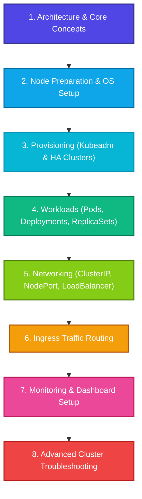

# ☸️ Kubernetes (K8s) DevOps Hub

> A curated, beautifully structured collection of Kubernetes technical guides, command cheat sheets, High-Availability (HA) cluster architecture walkthroughs, and hands-on diagnostic playbooks.

---

## 📖 Introduction

Welcome to the **Kubernetes DevOps Hub**! This repository serves as an enterprise-grade reference manual and training guide for Cloud & DevOps engineers looking to master Kubernetes administration, cluster provisioning, microservices routing, and production troubleshooting. 

This repository has been fully structured into clean, standardized Markdown formats containing robust, ready-to-run configurations, copy-pasteable YAML manifests, and real-world system debugging traces.

---

## 🗺️ Documentation Directory & Navigation Map

Navigate through the comprehensive modules in this workspace:

### 🏗️ 1. Cluster Architecture & Basics
* 📘 [Kubernetes Components Guide](file:///c:/Users/prem/Desktop/Cloud%20Computing/DevOps/k8s/K8s_componentes.md) - Learn about the Control Plane (API-Server, etcd, Scheduler, Controllers) and Node-level binaries (Kubelet, Kube-Proxy).
* 🔧 [Kubeadm Cluster Init (CentOS/RHEL)](file:///c:/Users/prem/Desktop/Cloud%20Computing/DevOps/k8s/kubeadm_init.md) - Learn how to build a single-master Kubernetes cluster from scratch.
* 🛡️ [HA K8s Cluster Setup Guide](file:///c:/Users/prem/Desktop/Cloud%20Computing/DevOps/k8s/HA_K8s_cluster_document.md) - Step-by-step master plan for setting up a highly available control plane with etcd quorum and an Nginx load balancer.

### ⚙️ 2. Workload & Service Routing
* 📦 [Deployment Management](file:///c:/Users/prem/Desktop/Cloud%20Computing/DevOps/k8s/k8s_Deployment.md) - Master Declarative Deployments, scaling replicas, rollouts, and historical undo modifications.
* 🔌 [Service Exposure Handbook](file:///c:/Users/prem/Desktop/Cloud%20Computing/DevOps/k8s/k8s_svc.md) - Real hands-on experience exposing pods via ClusterIP, NodePort, LoadBalancer, and hardcoded static node ports.
* 🌐 [Nginx Ingress Controller](file:///c:/Users/prem/Desktop/Cloud%20Computing/DevOps/k8s/Nginx%20Ingress%20Controller%20in%20Kubernetes.md) - Install and run the Nginx Ingress controller for high-performance traffic routing.
* 🍎 [Ingress Routing Examples](file:///c:/Users/prem/Desktop/Cloud%20Computing/DevOps/k8s/k8s-ingress-example.md) - Practical host-based routing simulations using http-echo pods.
* 🧪 [Ingress Testing Playbook](file:///c:/Users/prem/Desktop/Cloud%20Computing/DevOps/k8s/k8s%20Ingress-test.md) - Connect your internal cluster services to custom local domain names (`my-app.com`) using ingress rewrites.

### 🛠️ 3. Cheat Sheets & Playbooks
* 📝 [Play with Kubernetes Cheat Sheet](file:///c:/Users/prem/Desktop/Cloud%20Computing/DevOps/k8s/play_with_k8s.md) - A fast, all-in-one cheat sheet covering namespaces, pods, replication controllers, services, and taints.
* 💻 [Ultimate K8s Command Sheet](file:///c:/Users/prem/Desktop/Cloud%20Computing/DevOps/k8s/K8s_cmds.md) - Massive administrative command book with inbound firewall rules, Heapster metrics, and dashboard integrations.
* 🔓 [EC2 SSH Userdata Script](file:///c:/Users/prem/Desktop/Cloud%20Computing/DevOps/k8s/enable-passowrd-ssh-with-userdata.md) - Quick helper script to enable SSH password authentication on AWS EC2 nodes during bootstrap.

### 🩺 4. Debugging & Troubleshooting
* 🚨 [Basic Troubleshooting Playbook](file:///c:/Users/prem/Desktop/Cloud%20Computing/DevOps/k8s/k8s_basic_troubleshooting.md) - Diagnose CrashLoopBackOff, ImagePullBackOff, OOMKilled states, and schedule cordons.
* 🗒️ [Diagnostic & Administration Logs](file:///c:/Users/prem/Desktop/Cloud%20Computing/DevOps/k8s/k8s_trouble_shooting_steps.md) (Alternative: [1.md](file:///c:/Users/prem/Desktop/Cloud%20Computing/DevOps/k8s/1.md)) - Real-world master-node shell logs documenting pod failures, restores, and joins.

---

## 🗂️ Workspace Files & Content Overview

Below is a detailed hierarchical outline of every file in the workspace and the exact technical topics covered inside them:

### 🏗️ Category A: Core Cluster Architecture & Provisioning

#### 1. [K8s_componentes.md](file:///c:/Users/prem/Desktop/Cloud%20Computing/DevOps/k8s/K8s_componentes.md)
* **Description:** Conceptual architecture manual detailing the roles of core control plane components and node agents.
* **Key Contents:**
  * **Control Plane Components:** Core analysis of `kube-apiserver` (horizontal scaling), `etcd` (distributed key-value state), `kube-scheduler` (scheduling criteria), `kube-controller-manager` (node, replication, endpoint, and token loops), and `cloud-controller-manager` (cloud service/node/route bindings).
  * **Node Components:** Core roles of `kubelet` (PodSpecs executor), `kube-proxy` (internal packet filtering / load balancing), and Container Runtimes (CRI, containerd, CRI-O).
  * **Addon Implementations:** Core services including CoreDNS, Web UI Dashboard, monitoring suites, and centralized cluster-level logging.

#### 2. [kubeadm_init.md](file:///c:/Users/prem/Desktop/Cloud%20Computing/DevOps/k8s/kubeadm_init.md)
* **Description:** Step-by-step master node setup guide detailing host preparations and single-master bootstrapping.
* **Key Contents:**
  * **OS Pre-requisites:** Setting node hostnames, editing local `/etc/hosts` resolution tables, disabling SELinux and Firewalld services, and loading netfilter bridge modules.
  * **Package Management:** Setting up custom YUM repositories and installing precise versions of `kubelet-1.21.2`, `kubeadm-1.21.2`, and `kubectl-1.21.2`.
  * **Bootstrap Commands:** Executing `kubeadm init` with `--pod-network-cidr=10.244.0.0/16`, configuring local admin kubeconfig, and deploying the Flannel CNI network overlay.

#### 3. [HA_K8s_cluster_document.md](file:///c:/Users/prem/Desktop/Cloud%20Computing/DevOps/k8s/HA_K8s_cluster_document.md)
* **Description:** Advanced guide explaining the architecture and installation of a Highly Available Multi-Master control plane.
* **Key Contents:**
  * **HA Concepts:** Detailed study of `--upload-certs` mechanics, etcd lease quorums, and dynamic token-to-secret bindings.
  * **Proxy Setup:** Configuring an external Nginx Stream load balancer to proxy `kube-apiserver` traffic on port `6443`.
  * **Multi-Master Joins:** Creating custom `ClusterConfiguration` manifests and joining additional control-planes via `--experimental-control-plane` using certificate keys.
  * **Dashboard Access:** Setup and authorization of the official Web UI, creating a cluster-admin Service Account, and extracting JWT bearer authentication keys.

---

### ⚙️ Category B: Application Delivery & Service Mesh Routing

#### 4. [k8s_svc.md](file:///c:/Users/prem/Desktop/Cloud%20Computing/DevOps/k8s/k8s_svc.md)
* **Description:** Networking manual covering internal and external service exposure models.
* **Key Contents:**
  * **Service Types:** Architectural differences between ClusterIP, NodePort, and LoadBalancer abstractions.
  * **Networking Labs:** Exposing a sample 3-replica application in the `besant` namespace.
  * **Testing Traces:** Running curl tests against cluster-allocated IPs, exposing external NodePorts, and deploying LoadBalancer objects.
  * **Static Binding:** Defining and deploying services using fixed external ports (`nodePort: 30007`).

#### 5. [k8s_Deployment.md](file:///c:/Users/prem/Desktop/Cloud%20Computing/DevOps/k8s/k8s_Deployment.md)
* **Description:** Workload handbook explaining stateless applications management and rollout lifecycles.
* **Key Contents:**
  * **Manifest Syntax:** Declarative `.yaml` specifications using label selectors and template fields.
  * **Scaling Controls:** Imperative commands to scale replica sets to 0 (termination) and back up to 3 instances.
  * **Rollout Upgrades:** Triggering rolling updates by changing pod container images (e.g. Nginx to HTTPD Apache) and tracking rollout statuses.
  * **Rollback Undos:** Performing historic rollbacks (`rollout undo`) to restore running configurations to previous stable states.

#### 6. [Nginx Ingress Controller in Kubernetes.md](file:///c:/Users/prem/Desktop/Cloud%20Computing/DevOps/k8s/Nginx%20Ingress%20Controller%20in%20Kubernetes.md)
* **Description:** Technical guide outlining the installation of the enterprise-grade Nginx Ingress Controller.
* **Key Contents:**
  * **Capabilities:** High-level details of SSL/TLS termination, URI rewrites, and basic load balancing.
  * **Deployment Steps:** Cloning repositories, deploying the controller via `nginx-ingress.yaml`, and verifying daemon pods in the `ingress-nginx` namespace.

#### 7. [k8s-ingress-example.md](file:///c:/Users/prem/Desktop/Cloud%20Computing/DevOps/k8s/k8s-ingress-example.md)
* **Description:** Practical routing tutorial mapping HTTP paths to distinct cluster backends.
* **Key Contents:**
  * **Mock Applications:** Deploying dual mock pods (`apple-app` and `banana-app`) using the `hashicorp/http-echo` image.
  * **Ingress Mapping:** Creating an Ingress resource allocating routing paths `/apple` and `/banana` to respective service backend ports.
  * **Domain Access:** Modifying local `/etc/hosts` tables to map `example.com` to your Ingress NodePort and testing responses.

#### 8. [k8s Ingress-test.md](file:///c:/Users/prem/Desktop/Cloud%20Computing/DevOps/k8s/k8s%20Ingress-test.md)
* **Description:** Advanced Ingress testing walkthrough utilizing rewrite rules and custom local domains.
* **Key Contents:**
  * **Service Binding:** Creating a standard NodePort service and capturing its specific ClusterIP dynamically.
  * **Ingress Annotations:** Drafting `ingress.yaml` featuring path rewrites (`nginx.ingress.kubernetes.io/rewrite-target`) and binding rules targeting the local domain `my-app.com`.

---

### 🛠️ Category C: Cheat Sheets & Automation Scripts

#### 9. [play_with_k8s.md](file:///c:/Users/prem/Desktop/Cloud%20Computing/DevOps/k8s/play_with_k8s.md)
* **Description:** Developer sandbox quick reference mapping daily developer-level tasks.
* **Key Contents:**
  * **Namespace Operations:** Creating namespaces imperatively and declaratively via manifests, list queries, and namespace deletions.
  * **Pod Playbook:** Deploying pods, analyzing wide output details, and invoking ClusterIP/NodePort exposures.
  * **Workloads & Taints:** Provisioning ReplicationControllers, scaling deployments, and cordoning/untainting master nodes.

#### 10. [K8s_cmds.md](file:///c:/Users/prem/Desktop/Cloud%20Computing/DevOps/k8s/K8s_cmds.md)
* **Description:** Massive, master administration cheat sheet containing system provisioning commands and add-on setups.
* **Key Contents:**
  * **Ports Config:** Firewall parameters mapping required TCP ports on masters (6443, 2379) and worker nodes.
  * **OS Bootstrapping:** Provisioning scripts for Docker engines and Kubernetes binaries on Ubuntu servers.
  * **Token Generation:** Advanced script blocks to dynamically construct full worker node `kubeadm join` commands.
  * **Monitoring & Addons:** Deployments of Dashboard v1.8.3, Heapster resource collectors, and admin Service Accounts.

#### 11. [enable-passowrd-ssh-with-userdata.md](file:///c:/Users/prem/Desktop/Cloud%20Computing/DevOps/k8s/enable-passowrd-ssh-with-userdata.md)
* **Description:** Shell automation script designed to be run as cloud provider User Data.
* **Key Contents:**
  * **SSH Modifications:** Overriding sshd configuration parameters (`PasswordAuthentication yes`) and reloading the daemon.
  * **User Provisioning:** Shell commands automating the creation of non-root admin users and injecting secure root credentials.

---

### 🩺 Category D: Diagnostic Logs & Troubleshooting Guides

#### 12. [k8s_basic_troubleshooting.md](file:///c:/Users/prem/Desktop/Cloud%20Computing/DevOps/k8s/k8s_basic_troubleshooting.md)
* **Description:** Reference manual detailing the standard procedures for debugging cluster failures.
* **Key Contents:**
  * **Node Health:** Recovering crashed kubelet services and analyzing system logs via journalctl.
  * **Pod Troubleshooting:** Diagnostic tables mapping states like `CrashLoopBackOff`, `ImagePullBackOff`, and `Pending` to root causes.
  * **Log Inspections:** Capturing output streams of terminated or restarting containers using `--previous` flags.
  * **Cordoning Scenarios:** Step-by-step trace showing the scheduling consequences of cordoning nodes.

#### 13. [k8s_trouble_shooting_steps.md](file:///c:/Users/prem/Desktop/Cloud%20Computing/DevOps/k8s/k8s_trouble_shooting_steps.md) & [1.md](file:///c:/Users/prem/Desktop/Cloud%20Computing/DevOps/k8s/1.md)
* **Description:** Companion troubleshooting logs documenting an active recovery session.
* **Key Contents:**
  * **Diagnostic Logs:** Checking kubelet service states, reviewing container status codes, and inspecting image pulling permissions.
  * **Cordon Operations:** Restricting worker scheduling during active maintenance windows.
  * **Disaster Recovery:** Exporting running deployment manifests into backup YAML files (`savedeploy.yaml`), deleting corrupt workloads, and applying clean state restores.
  * **Node Re-join:** Generating new token keys to link missing node workers back to the cluster control plane.

---

## 🚀 The Kubernetes Learning Roadmap

Follow this step-by-step roadmap to become a Kubernetes Certified Administrator (CKA/CKAD):



### 📍 Phase 1: Core Fundamentals
* Learn control plane components, scheduling models, and etcd data storage.
* *Resource:* [K8s_componentes.md](file:///c:/Users/prem/Desktop/Cloud%20Computing/DevOps/k8s/K8s_componentes.md)

### 📍 Phase 2: Single-Node & Multi-Master Provisioning
* Understand kernel parameters (`br_netfilter`), disabling swap space, setting hosts mappings, and running CNI fabrics.
* Practice setting up external Nginx load-balancers to route traffic securely to control-plane APIServers on `port 6443`.
* *Resources:* [kubeadm_init.md](file:///c:/Users/prem/Desktop/Cloud%20Computing/DevOps/k8s/kubeadm_init.md) & [HA_K8s_cluster_document.md](file:///c:/Users/prem/Desktop/Cloud%20Computing/DevOps/k8s/HA_K8s_cluster_document.md)

### 📍 Phase 3: Workload Scaling & Declarative Configurations
* Author precise `.yaml` specs, control scale counts (`--replicas=N`), execute RollingUpdates, and rollout undos.
* *Resources:* [k8s_Deployment.md](file:///c:/Users/prem/Desktop/Cloud%20Computing/DevOps/k8s/k8s_Deployment.md) & [play_with_k8s.md](file:///c:/Users/prem/Desktop/Cloud%20Computing/DevOps/k8s/play_with_k8s.md)

### 📍 Phase 4: Networking & Advanced Ingress Controllers
* Set up internal Service abstractions, dynamic load balancers, and static `NodePort` targets.
* Implement path-based routing rules, host headers, custom local domains (`example.com`), and install the Nginx Ingress Controller.
* *Resources:* [k8s_svc.md](file:///c:/Users/prem/Desktop/Cloud%20Computing/DevOps/k8s/k8s_svc.md), [Nginx Ingress Controller in Kubernetes.md](file:///c:/Users/prem/Desktop/Cloud%20Computing/DevOps/k8s/Nginx%20Ingress%20Controller%20in%20Kubernetes.md), & [k8s-ingress-example.md](file:///c:/Users/prem/Desktop/Cloud%20Computing/DevOps/k8s/k8s-ingress-example.md)

### 📍 Phase 5: Debugging, Metrics, & Administration
* Master event logs querying (`kubectl get events`), pod details descriptions, resource metrics troubleshooting (CPU/Memory/OOMKilled), cordoning nodes, and recovering deployments using active configuration backups.
* *Resources:* [k8s_basic_troubleshooting.md](file:///c:/Users/prem/Desktop/Cloud%20Computing/DevOps/k8s/k8s_basic_troubleshooting.md) & [K8s_cmds.md](file:///c:/Users/prem/Desktop/Cloud%20Computing/DevOps/k8s/K8s_cmds.md)

---

## 💻 Cluster Setup Quick Start

To instantly fire up your single-master cluster (assuming prerequisites are met):

```bash
# 1. Disable swap space (Required for kubeadm)
sudo swapoff -a

# 2. Initialize the cluster
sudo kubeadm init --pod-network-cidr=10.244.0.0/16

# 3. Configure kubectl for your user
mkdir -p $HOME/.kube
sudo cp -i /etc/kubernetes/admin.conf $HOME/.kube/config
sudo chown $(id -u):$(id -g) $HOME/.kube/config

# 4. Deploy Flannel CNI Network fabric
kubectl apply -f https://raw.githubusercontent.com/flannel-io/flannel/master/Documentation/kube-flannel.yml
```

---

## 🛠️ Contribution & Local Use

1. Feel free to copy, alter, or add new configuration snippets to these guides.
2. Keep manifests clean and formatted with `YAML` syntax fences.
3. Test your commands inside a sandbox cluster (e.g. Minikube, Kind, or AWS EC2 instances).

*Happy Kubernetes Hacking! 🚀*
